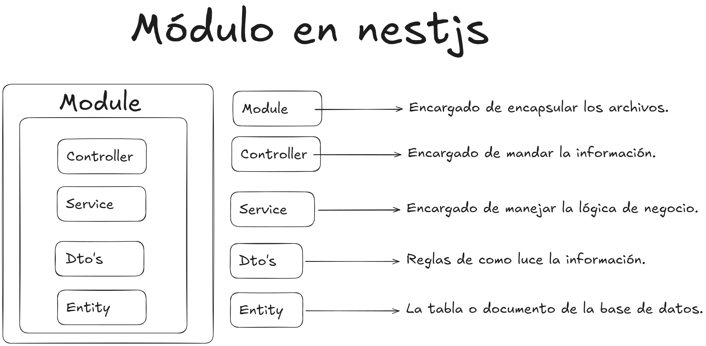

## NestJS

Framework progresivo para **Node.js** que permite construir aplicaciones del lado del servidor robustas y escalables. Se basa en una arquitectura modular, inspirada en Angular, que organiza el código en módulos, controladores y servicios. 

Utiliza decoradores para definir los componentes y su inyección de dependencias, lo que facilita la mantenibilidad y testabilidad del código. Fuertemente en **Angular** y **Spring Boot**.

Su arquitectura modular permite diviridr la aplicación en modulos independientes, para facilirtar la organización y reutilización del código.

### Arquitectura

***Módulos***: Los módulos son la unidad básica de organización. Cada módulo encapsula un conjunto de funcionalidades relacionadas. Un módulo se define mediante un decorador `@Module` y puede importar otros módulos, declarar componentes (controladores, servicios, etc.) y exportar componentes para que otros módulos los utilicen.

***Controladores***: Los controladores manejan las solicitudes entrantes y devuelven las respuestas al cliente. Se definen mediante el decorador `@Controller`.

***Servicios***: Los servicios contienen la lógica de negocio y se pueden inyectar en controladores u otros servicios. Se definen mediante el decorador `@Injectable`.

***Inyección de Dependencias***: Permite gestionar las dependencias entre los diferentes componentes de la aplicación de manera eficiente.


## Arquitectura de Nestjs


### Ejemplo de Módulo
```typescript
import { Module } from '@nestjs/common';
import { AppController } from './app.controller';
import { AppService } from './app.service';
import { UsersModule } from './users/users.module';

@Module({
  imports: [UsersModule],
  controllers: [AppController],
  providers: [AppService],
})
export class AppModule {}
```

##### Módulo
```typescript
import { Module } from '@nestjs/common';
import { DentistaService } from './dentista.service';
import { DentistaController } from './dentista.controller';
import { TypeOrmModule } from '@nestjs/typeorm';
import { Dentista } from './entities/dentista.entity';
import { AuthModule } from '../auth/auth.module';

@Module({
  controllers: [DentistaController],
  providers: [DentistaService],
  imports: [
    TypeOrmModule.forFeature([Dentista]),
    AuthModule,
  ],
  exports: [DentistaService]
})
export class DentistaModule {}
```

##### Controlador
```typescript
import { Controller, Get, Post, Body, Patch, Param, Delete } from '@nestjs/common';
import { DentistaService } from './dentista.service';
import { CreateDentistaDto } from './dto/create-dentista.dto';
import { UpdateDentistaDto } from './dto/update-dentista.dto';
import { Auth } from '../auth/decorators';
import { ValidRoles } from '../auth/interfaces';
import { ApiBearerAuth, ApiOperation, ApiTags } from '@nestjs/swagger';

@ApiTags('Dentista')
@ApiBearerAuth()
@Controller('dentista')
export class DentistaController {
  constructor(private readonly dentistaService: DentistaService) {}

  @ApiOperation({ summary: 'Registrar nuevos dentistas', description: 'Necesita del rol creator' })
  @Auth(ValidRoles.creator)
  @Post('create')
  create(@Body() createDentistaDto: CreateDentistaDto) {
    return this.dentistaService.create(createDentistaDto);
  }

  @ApiOperation({ summary: 'Obtener dentistas con filtros', description: 'Necesita del rol creator' })
  @Auth(ValidRoles.creator)
  @Get('get')
  findAll() {
    return this.dentistaService.findAll();
  }

  @ApiOperation({ summary: 'Obtener dentistas por id', description: 'Necesita del rol creator' })
  @Auth(ValidRoles.creator)
  @Get('findOne/:id')
  findOne(@Param('id') id: string) {
    return this.dentistaService.findOne(+id);
  }

  @ApiOperation({ summary: 'Actualizar dentista por id', description: 'Necesita del rol creator' })
  @Auth(ValidRoles.creator)
  @Patch('update/:id')
  update(@Param('id') id: string, @Body() updateDentistaDto: UpdateDentistaDto) {
    return this.dentistaService.update(+id, updateDentistaDto);
  }

  @ApiOperation({ summary: 'Eliminar dentista por id', description: 'Necesita del rol creator' })
  @Auth(ValidRoles.creator)
  @Delete('delete/:id')
  remove(@Param('id') id: string) {
    return this.dentistaService.remove(+id);
  }
}
```

##### Servicio
```typescript
import { Injectable, NotFoundException, Logger } from '@nestjs/common';
import { CreateDentistaDto } from './dto/create-dentista.dto';
import { UpdateDentistaDto } from './dto/update-dentista.dto';
import { InjectRepository } from '@nestjs/typeorm';
import { Dentista } from './entities/dentista.entity';
import { Repository } from 'typeorm';
import { handleDBExceptions } from '../../common/helpers/handleBDExeptions';

@Injectable()
export class DentistaService {

  private readonly logger = new Logger('DentistaService');

  constructor(
    @InjectRepository(Dentista)
    private readonly dentistaRepository: Repository<Dentista>
  ) {}

  async create(createDentistaDto: CreateDentistaDto) {
    const dentista = await this.dentistaRepository.create({
      ...createDentistaDto
    });

    await this.dentistaRepository.save(dentista);

    return dentista;
  }

  async findAll() {
    const totalDentistas = await this.dentistaRepository.count();

    const dentistas = await this.dentistaRepository.find({
      take: totalDentistas
    });

    if (!dentistas) throw new NotFoundException(`No se encontraron dentistas`);

    return dentistas;
  }

  async findOne(id: number) {
    const dentista = await this.dentistaRepository.findOne({
      where: { dentista_id: id }
    });

    if (!dentista) throw new NotFoundException(`No se encontró dentista`);

    return dentista;
  }

  async update(id: number, updateDentistaDto: UpdateDentistaDto) {
    try {
      const nuevoDentista = await this.dentistaRepository.preload({
        ...updateDentistaDto,
        dentista_id: id
      });

      if (!nuevoDentista) throw new NotFoundException(`Dentista con ID ${id} no encontrado`);

      await this.dentistaRepository.save(nuevoDentista);
      return nuevoDentista;
    } catch (error) {
      handleDBExceptions(this.logger, error, 'dentista');
    }
  }

  async remove(id: number) {
    const dentista: Dentista = await this.findOne(id);

    dentista.dentista_eliminado = true;

    await this.dentistaRepository.save(dentista);

    return { message: 'Dentista eliminado' };
  }

  async deleteAllDentists() {
    await this.dentistaRepository.clear();
    this.logger.debug('Todos los dentistas eliminados');
    return { message: 'Todos los dentistas fueron eliminados' };
  }
}
```

